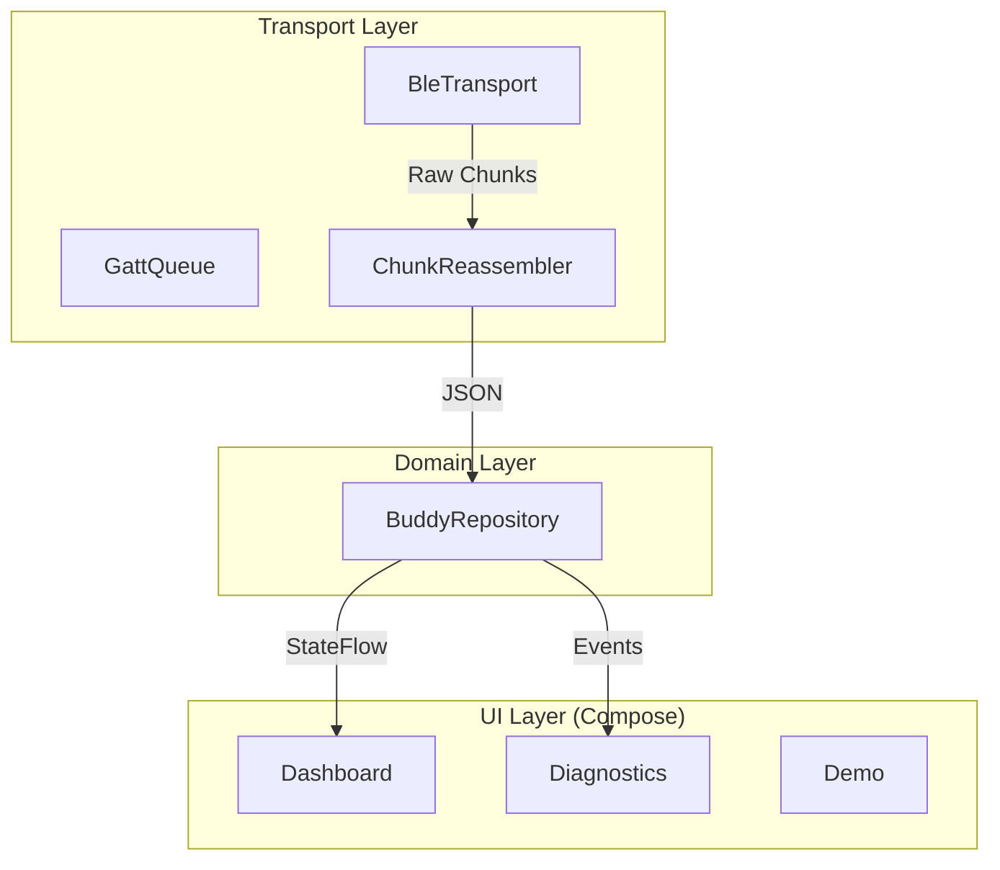

# CodeIsland Android Buddy Lite

[](https://kotlinlang.org/)
[](https://developer.android.com/jetpack/compose)
[](LICENSE)

Android companion app for [CodeIsland](https://github.com/wxtsky/CodeIsland) — mirrors Mac AI agent session state to your Android phone via BLE.

## 📱 Features

- **Live Status Monitoring**: Real-time view of agent status (idle, processing, running, waiting).
- **Multi-Agent Overview**: Supports tracking up to 5 concurrent AI sessions (Codex, Claude, Gemini, etc.).
- **Smart Notifications**: High-priority alerts when an agent requires approval or has a question.
- **Robust BLE Transport**: Custom GATT operation queue and chunk reassembler for reliable JSON sync over Bluetooth LE.
- **Deep Diagnostics**: Built-in tools for permission verification, BLE event logging, and HyperOS background optimization guides.
- **Demo Mode**: Full-featured preview mode to explore the UI without needing a Mac.
- **Glance Widget**: Home screen widget for at-a-glance session tracking.

## 🏗 Architecture

The project follows a modern reactive layered architecture:



### Key Components
- **BleTransport**: Manages the BLE lifecycle, scanning, and connection state machine.
- **GattOperationQueue**: Ensures thread-safe, sequential GATT operations with timeout handling.
- **BuddyRepository**: The "Source of Truth" using `StateFlow` to drive the entire UI.
- **NotificationController**: Sequence-based deduplication logic to prevent notification spam.

## 🛠 Tech Stack

- **Kotlin & Coroutines**: Structured concurrency for asynchronous BLE operations.
- **Jetpack Compose**: 100% declarative UI with Material 3.
- **Lifecycle Compose**: Efficient state collection using `collectAsStateWithLifecycle`.
- **Room & DataStore**: Persistent storage for diagnostic logs and user preferences.
- **Glance**: Remote-view based home screen widgets using Compose-like syntax.
- **Kotlinx Serialization**: Type-safe JSON parsing for the BLE protocol.

## 🚀 Getting Started

### Requirements
- Android 10+ (API 29+)
- Bluetooth Low Energy (BLE) support

### Build & Install
```bash
# Clone the repository
git clone https://github.com/sky18Dragon/codelsland-android-buddy-lite.git
cd codelsland-android-buddy-lite

# Build Debug APK
./gradlew assembleDebug
```

### Setup Instructions
1. **On Mac**: Open CodeIsland → Settings → Buddy → Enable "iPhone Buddy" (uses the same BLE protocol).
2. **On Android**: Install the APK and grant Bluetooth & Notification permissions.
3. **Connection**: The app will automatically discover your Mac. Ensure both devices have Bluetooth enabled.
4. **Xiaomi/HyperOS Users**: Check the **Diagnostics** screen for instructions on enabling "Background Autostart" to ensure stable syncing.

## 📝 Known Limitations
- **Mirror-Only**: Due to platform restrictions (Apple's MultipeerConnectivity is proprietary), interactive actions (approving, answering questions) must be performed on the Mac.
- **Read-Only**: The app acts as a secondary screen for monitoring and alerts.

## 📄 License
This project is licensed under the MIT License - see the upstream [CodeIsland](https://github.com/wxtsky/CodeIsland) repository for details.
